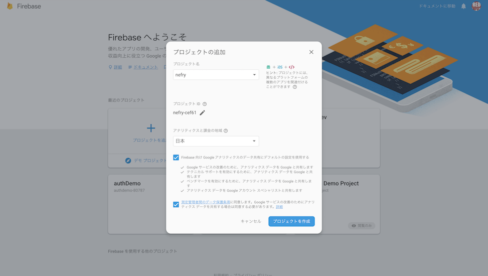
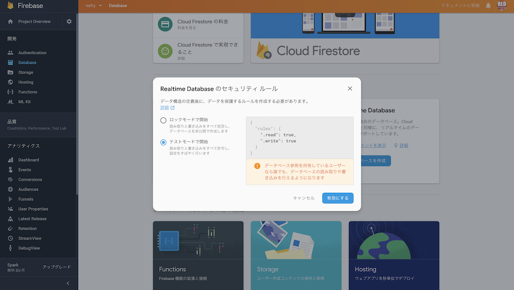
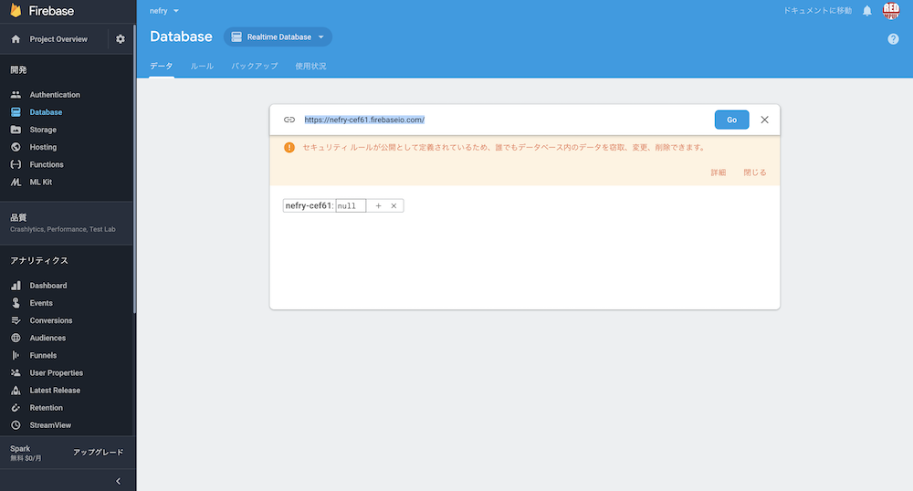
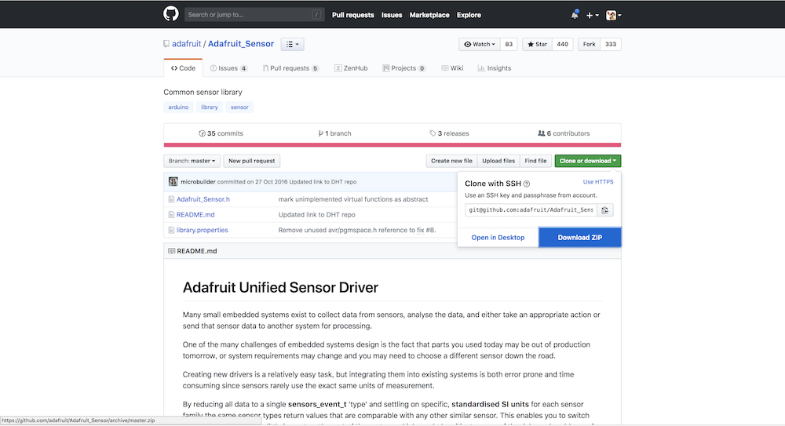
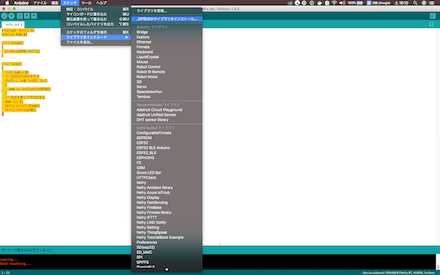

# IoT勉強会資料

## NefryとIFTTTでノンプログラムでtweetを行う

https://dotstud.io/docs/nefrybt-ifttt/

---

## Lチカ
ここではNefry BTに対してプログラムを書きこむ方法を学ぶ  
https://dotstud.io/docs/nefrybt-led/

### うまくプログラムが書き込めない場合は

設定を以下のように変えてみよう
> ツール >　Upload Speed : 460800  
ツール > ボード: Nefry BT

---

## センサによるデータの取得

ここからはNefryに外部のセンサーを取り付けてセンサの値を取得する方法を学ぶ。  

---

# 光センサの値をfirebaseに送信して記録する

## 光センサの値を確認する
Nefry BTのA2と書かれたソケットに光センサを接続する。  
Arduino IDEから以下のプログラムを書き込んで実行する

```
#include <Nefry.h>
#define PIN A2

void setup()
{
  pinMode(PIN,INPUT);
}

void loop()
{
  long sum = 0;
  // 32回分の合計をする
  for(int i=0; i<32; i++)
  {
    sum += analogRead(PIN);
  }
  // 合計を割って平均を取る
  sum >>= 5;
  Nefry.println(sum);
  Nefry.ndelay(10);
}

```

**ツール > シリアルモニタ** からシリアルモニタを開くと値を確認することができる  
**ツール > シリアルプロット** を選択するとグラフで確認することができる  
115200bpsで確認  
*同時に二つ開くことはできないので注意*

---

## Firebaseへの記録

プロジェクトの作成



---

 左の「Database」を選択して「Realtime Database」を選択


---

テストモードを選択



---

databaseのURLをメモ



---

Nefryに以下のコードを書き込む  
FIREBASE_HOSTの部分はメモしたものを記述(https://は抜いて)  
値がリアルタイムで更新されるのが確認できる
```
#define FIREBASE_HOST "xxxx.firebaseio.com"

NefryFireBase firebase;
void setup()
{
  pinMode(PIN,INPUT);
  firebase.begin(FIREBASE_HOST);
}

void loop()
{
  DataElement elem = DataElement();
  elem.setValue("sensor", analogRead(PIN));
  firebase.write("Nefry", &elem);//FireBaseのデータを書き込みます
  Nefry.ndelay(1000);
}
```


## webページを作って値を取得する
htmlのページを自作してブラウザから値を確認する。  
以下のソースのdatabaseURLを変更して使用する。  
更新すると値が確認できる。
```
<html>

<body>
    <p>
        <div id="sensor"></div>
    </p>
    <script src="https://www.gstatic.com/firebasejs/4.12.1/firebase.js"></script>
    <script>
        var config = {
            //apiKey: "nefry-cef61",
            //authDomain: "projectId.firebaseapp.com",
            databaseURL: "https://xxxx.firebaseio.com", // ここの値を変更する
            //storageBucket: "bucket.appspot.com"
        };
        firebase.initializeApp(config);
        var database = firebase.database();
        var dataRef = database.ref('/Nefry');
        dataRef.once("value")
            .then(function (snapshot) {
                document.getElementById("sensor").innerHTML = snapshot.child("sensor").val();
            });
    </script>
</body>

</html>

```


---

# 付録(他のセンサの使い方)
ここからは光センサ以外のセンサーや出力装置のサンプルコードを紹介する  
サンプルによってはArduino IDEに外部ライブラリのインストールが必要になる  


# サーボモータ

```
//Groveケーブルを接続するGroveコネクターを１つ選んで#define文に記載してください。
// Nefry BT無印の場合： D2, A0, A2 (注：D0は使えません）
// Nefry BT R2の場合： D0, D2, D5, A1  (注：A0を使うときはA1を記載します)
#define PIN D2

// LEDCのパラメータ設定
//   LEDC_CHANNEL        : チャンネル : 0
//   LEDC_RESOLUTION_BITS: 目盛数    : 10bit (0〜1023)
//   LEDC_FREQUENCY  : 周波数    : 50Hz (= 20ms周期)
#define LEDC_CHANNEL 0
#define LEDC_RESOLUTION_BITS 10
#define LEDC_FREQUENCY 50

//  30/1024*20ms = 0.59ms
//  77/1024*20ms = 1.50ms
// 122/1024*20ms = 2.38ms
uint32_t pulse[3] = {30, 77, 122};
int n = 0;

void setup() {
  ledcSetup(LEDC_CHANNEL, LEDC_FREQUENCY, LEDC_RESOLUTION_BITS);
  ledcAttachPin(PIN, LEDC_CHANNEL);
  Serial.println(pulse[n]);
  ledcWrite(0, pulse[n]);
  Nefry.enableSW();
}

void loop() {
  if (Nefry.readSW()) {
    n = (n+1) % 3;
    Serial.println(pulse[n]);
    ledcWrite(0, pulse[n]);
  }
}
```

# 傾向センサ/モーションセンサ/水センサ
http://wiki.seeedstudio.com/Grove-Tilt_Switch/

ON: 10° ~170°
OFF: 190° ~350°
```


// test code for Grove - Sound Sensor
// loovee @ 2016-8-30

#define PIN D2

void setup()
{
 Serial.begin(115200);
 pinMode(PIN,INPUT);
}

void loop()
{
  int v = digitalRead(PIN);
  Serial.println(v);
  delay(10);
}
```


# LED bar
```
/*
Grove LED Bar - Level Example
This example will show you how to use setLevel() function of this library.
The setLevel() function illuminates the given number of LEDs from either side.

Syntax setLevel(level)
0  = all LEDs off
5  = 5 LEDs on
10 = all LEDs on
*/

#include <Grove_LED_Bar.h>

Grove_LED_Bar bar(D3, D2, 0);  // Clock pin, Data pin, Orientation

void setup()
{
  // nothing to initialize
  bar.begin();
}

void loop()
{
  // Walk through the levels
  for (int i = 0; i <= 10; i++)
  {
    bar.setLevel(i);
    delay(100);
  }
}
```


# 温湿度センサ
以下のライブラリをインストールするする  
https://github.com/adafruit/Adafruit_Sensor  
https://github.com/adafruit/DHT-sensor-library  

### 外部ライブラリーのインポートの仕方  
zip形式でダウンロード




Arduino IDE  
スケッチ > ライブラリをインクルード > ZIP形式のライブラリをインストール




---

```
#include <Nefry.h> // Nefryのライブラリをインクルード

#include "DHT.h"
#define DHTPIN D2    // 値をD4に変更（接続するピンに応じて変更）

#define DHTTYPE DHT11   // DHT 11に変更

DHT dht(DHTPIN, DHTTYPE);

void setup() {
  //Serial.begin(9600); 削除
  Nefry.println("DHTxx test!"); // SerialをNefryへ変更
  dht.begin();
}

void loop() {
  Nefry.ndelay(2000); // Serial.delayをNefry.ndelayへ変更

  float h = dht.readHumidity();
  float t = dht.readTemperature();
  float f = dht.readTemperature(true);

  if (isnan(h) || isnan(t) || isnan(f)) {
    Nefry.println("Failed to read from DHT sensor!"); // SerialをNefryへ変更
    return;
  }

  float hif = dht.computeHeatIndex(f, h);
  float hic = dht.computeHeatIndex(t, h, false);

  Nefry.print("Humidity: ");    // SerialをNefryへ変更
  Nefry.print(h);               // SerialをNefryへ変更
  Nefry.print(" %\t");          // SerialをNefryへ変更
  Nefry.print("Temperature: "); // SerialをNefryへ変更
  Nefry.print(t);               // SerialをNefryへ変更
  Nefry.print(" *C ");          // SerialをNefryへ変更
  Nefry.print(f);               // SerialをNefryへ変更
  Nefry.print(" *F\t");         // SerialをNefryへ変更
  Nefry.print("Heat index: ");  // SerialをNefryへ変更
  Nefry.print(hic);             // SerialをNefryへ変更
  Nefry.print(" *C ");          // SerialをNefryへ変更
  Nefry.print(hif);             // SerialをNefryへ変更
  Nefry.println(" *F");         // SerialをNefryへ変更
}
```


Nefryのディフォルトプログラム
```
#include <NefryIFTTT.h>
#include <WiFiClientSecure.h>

String Event, SecretKey, LineAuth, SendMessageLINE;
WiFiClientSecure client;
String StrPerEncord(const char* c_str);
String escapeParameter(String param);
void LineSend();

void setup() {
  Nefry.setStoreTitle("SecretKey", 0); //Nefry DataStoreのタイトルを指定
  Nefry.setStoreTitle("Event", 1);    //Nefry DataStoreのタイトルを指定
  Nefry.setStoreTitle("LINE Auth", 2); //Nefry DataStoreのタイトルを指定
  Nefry.setStoreTitle("LINEMessage", 3);    //Nefry DataStoreのタイトルを指定
  SecretKey = Nefry.getStoreStr(0);   //Nefry DataStoreからデータを取得
  Event = Nefry.getStoreStr(1);       //Nefry DataStoreからデータを取得
  LineAuth = Nefry.getStoreStr(2);   //Nefry DataStoreからデータを取得
  SendMessageLINE = Nefry.getStoreStr(3);       //Nefry DataStoreからデータを取得
  Nefry.enableSW();                   //SW有効化
  Nefry.setProgramName("NefryBT Default Program");
}

void loop() {
  if (Nefry.readSW()) {               //SWを押した時
    if (!SecretKey.equals("") && !Event.equals("")) {
      if (!IFTTT.send(Event, SecretKey)) {//IFTTTにデータを送信
        Nefry.setLed(255, 0, 0);        //Errの時、赤色点灯
      }
    }
    if (!LineAuth.equals("")) {
      if (SendMessageLINE.equals(""))SendMessageLINE = "Welcome to the NefryBT world!";
      LineSend();                     //LINE送信
    }
    Nefry.ndelay(1000);               //送信後1秒間待つ
  }
  Nefry.setLed(random(255), random(255), random(255));
  Nefry.ndelay(500);               //送信後0.5秒間待つ
}

void LineSend() {
  const char* host = "notify-api.line.me";
  Serial.println("\nStarting connection to server...");
  if (!client.connect(host, 443)) {
    Serial.println("Connection failed!");
  } else {
    Serial.println("Connected to server!");
    String url = "/api/notify";
    url += "?message=";
    url += StrPerEncord(escapeParameter(SendMessageLINE).c_str());
    Serial.println(StrPerEncord(SendMessageLINE.c_str()));
    Serial.println(url);
    client.print(String("POST ") + url + " HTTP/1.1\r\n" +
                 "Authorization: Bearer " + LineAuth + "\r\n" +
                 "Content-Type: application/x-www-form-urlencoded\r\n" +
                 "Host: " + host + "\r\n" +
                 "Connection: close\r\n\r\n");
    client.println();
    unsigned long timeout = millis();
    while (client.available() == 0) {
      if (millis() - timeout > 5000) {
        Serial.println(">>> Client Timeout !");
        client.stop();
        return;
      }
    }
    // Read all the lines of the reply from server and print them to Serial
    while (client.available()) {
      String line = client.readStringUntil('\r');
      Serial.print(line);
    }
    Serial.println();
    Serial.println("closing connection");
  }
}
//********************UTF-8文字列をパーセントエンコード*************************
String StrPerEncord(const char* c_str) {
  uint16_t i = 0;
  String str_ret = "";
  char c1[3], c2[3], c3[3];

  while (c_str[i] != '\0') {
    if (c_str[i] >= 0xC2 && c_str[i] <= 0xD1) { //2バイト文字
      sprintf(c1, "%2x", c_str[i]);
      sprintf(c2, "%2x", c_str[i + 1]);
      str_ret += "%" + String(c1) + "%" + String(c2);
      i = i + 2;
    } else if (c_str[i] >= 0xE2 && c_str[i] <= 0xEF) {
      sprintf(c1, "%2x", c_str[i]);
      sprintf(c2, "%2x", c_str[i + 1]);
      sprintf(c3, "%2x", c_str[i + 2]);
      str_ret += "%" + String(c1) + "%" + String(c2) + "%" + String(c3);
      i = i + 3;
    } else {
      str_ret += String(c_str[i]);
      i++;
    }
  }
  return str_ret;
}

String escapeParameter(String param) {
  param.replace("%", "%25");
  param.replace("+", "%2B");
  param.replace(" ", "+");
  param.replace("\"", "%22");
  param.replace("#", "%23");
  param.replace("$", "%24");
  param.replace("&", "%26");
  param.replace("'", "%27");
  param.replace("(", "%28");
  param.replace(")", "%29");
  param.replace("*", "%2A");
  param.replace(",", "%2C");
  param.replace("/", "%2F");
  param.replace(":", "%3A");
  param.replace(";", "%3B");
  param.replace("<", "%3C");
  param.replace("=", "%3D");
  param.replace(">", "%3E");
  param.replace("?", "%3F");
  param.replace("@", "%40");
  param.replace("[", "%5B");
  param.replace("\\", "%5C");
  param.replace("]", "%5D");
  param.replace("^", "%5E");
  param.replace("'", "%60");
  param.replace("{", "%7B");
  param.replace("|", "%7C");
  param.replace("}", "%7D");
  return param;
}

```