<!-- $theme: default -->
<!-- page_number: true -->
<!-- $size: 4:3 -->

IoTハッカソン 〜business〜 事前勉強会【NefryでIoTハンズオン】Day 1
===
---
# 目次
1. ノンプログラミングでTwitter投稿を行ってみよう

2. LEDを光らせるプログラムを書いてみよう

3. 光センサの情報を取得して記録してみよう
---
1.NefryとIFTTTを用いて
ノンプログラミングでTwitter投稿を行おう
===
https://dotstud.io/docs/nefrybt-ifttt/

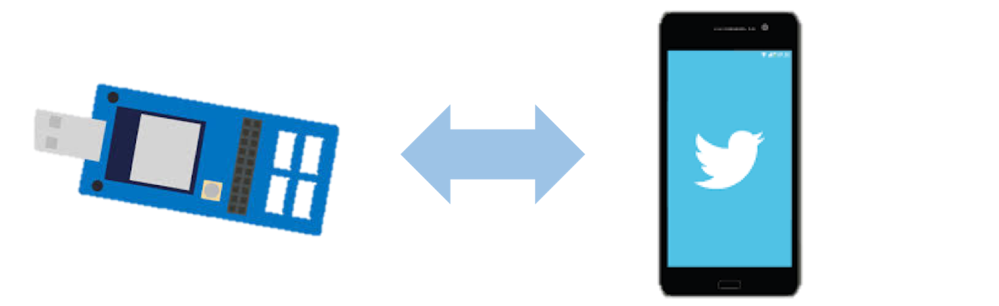

---

### Nefry BTとは?
IFTTT等のインターネットのサービスとハードウェアを簡単に接続できるIoTデバイス. Wi-Fi / BLE通信モジュール「ESP-WROOM-32」を搭載


### IFTTT (if this, then that) とは？
LINE, Twitter, Slack など，様々なWebサービス同士を
簡単に連携(レシピと呼ぶ)できるサービス


### NefryとIFTTT連携の手順

⑴ IFTTTにレシピを作成 → ⑵ Secret Key を取得  
→ ⑶ Nefry BT の設定ページでSecret Key を登録

---
# (0) IFTTT,twitter のアカウント作成

- IFTTTのアカウントを作成 https://ifttt.com 


- (アカウントを取得していない人のみ)
twitter のアカウントを作成 https://twitter.com/


---
# ⑴ IFTTTにレシピを作成

レシピ：
if <font color="Red">this</font> then <font color="Blue">that</font>

<font color="Red">〇〇</font> が起きたら <font color="Blue">△△</font> する

<font color="Red">Nefryのボタンを押し</font> たら <font color="Blue">IFTTTのWebhooksにアクセス</font> する

---
## ⑴ IFTTTにレシピを作成
 <font color="Red">[Thisの設定]　</font>「+this」 をクリック

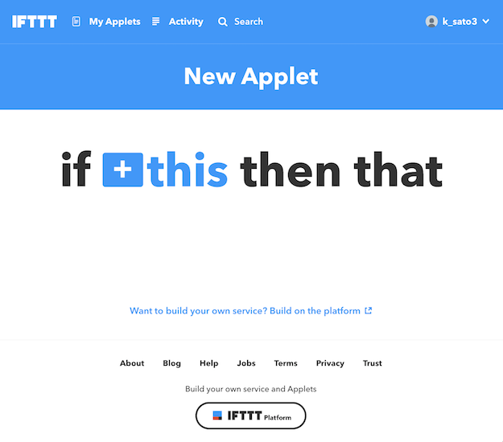

---
## ⑴ IFTTTにレシピを作成
<font color="Red">[Thisの設定]</font>webhooksを検索し，webhooksのアイコンをクリック

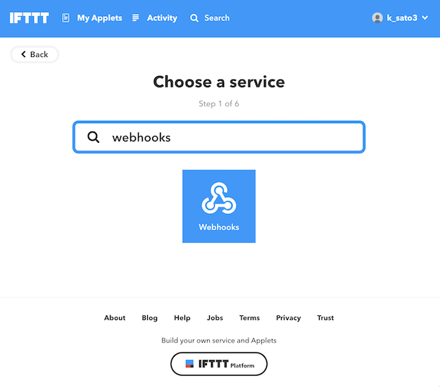

---
## ⑴ IFTTTにレシピを作成
<font color="Red">[Thisの設定]</font>「Receive a web request」 をクリック

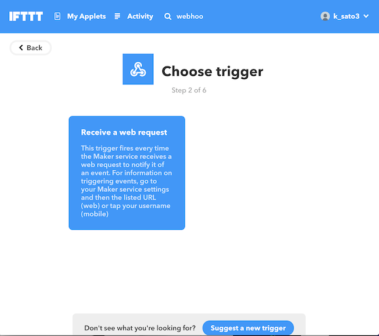

---
## ⑴ IFTTTにレシピを作成
<font color="Red">[Thisの設定]</font>
Event Nameに Nefry_IFTTT と記入し,「Create trigger」をクリック 


---
## ⑴ IFTTTにレシピを作成
<font color="Blue">[Thatの設定]</font>「+that」 をクリック


---
## ⑴ IFTTTにレシピを作成
<font color="Blue">[Thatの設定]</font>twitter を検索し，twitterのアイコンをクリック 

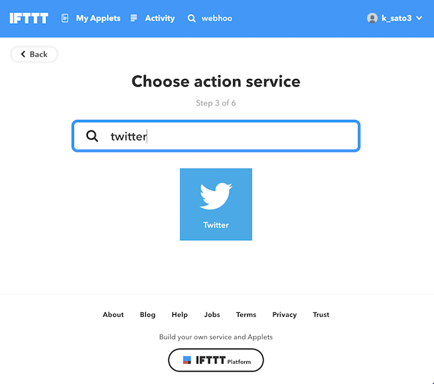

---
## ⑴ IFTTTにレシピを作成
<font color="Blue">[Thatの設定]</font>「Post a tweet」をクリック 


---
## ⑴ IFTTTにレシピを作成
<font color="Blue">[Thatの設定]</font>Tweet text 欄にツイートしたい内容を入力し，
(例:【Bot】Nefry BTとIFTTT連携test )
「Create action」 をクリック 


---
## ⑴ IFTTTにレシピを作成
<font color="Blue">[Thatの設定]</font>「Finish」をクリック 


これで, 「<font color="Red">Nefryのボタンを押し</font>たら<font color="Blue">IFTTTのWebhooksにアクセス</font>する」レシピの作成完了です．

---
#  ⑵ webhooksのSecret Key を取得
---

##  ⑵ Secret Key を取得
webhooks で検索

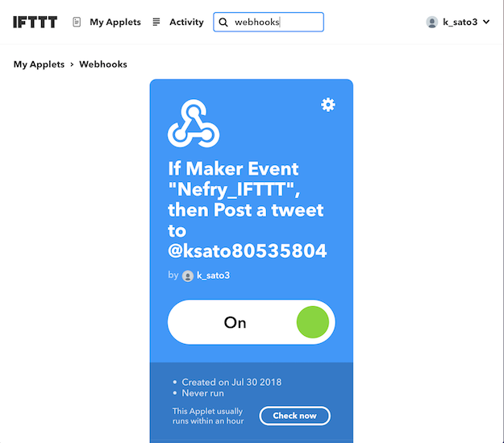

---
##  ⑵ Secret Key を取得
「Services」をクリックし，webhooksのアイコンをクリック

 

---
##  ⑵ Secret Key を取得
右上の「Settings」をクリック


---
##  ⑵ Secret Key を取得
URLの末尾の自身のSecret Keyをコピー

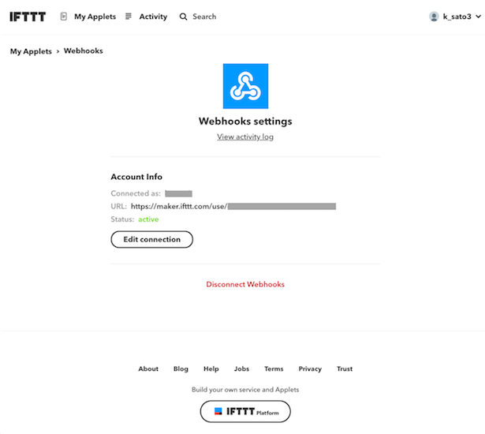

次に，コピーしたWebhooksの Secret Key を Nefry に登録します．

---
# ⑶Nefry BTの設定ページでSecret Keyを登録

---
## ⑶ Nefry BT の設定ページでSecret Key を登録
### wifi設定
- Nefry BTを自分のPCに接続．
- "NefryBT-(数字)"というWi-Fiに接続．


  Wi-Fiに接続すると自動で設定ページのウィンドウが立ち上がる．
  （立ち上がらない場合はブラウザでhttp://192.168.4.1にアクセス）

  このページからNefry BTに関する様々な設定が可能．


---
## ⑶ Nefry BT の設定ページでSecret Key を登録
### wifi設定
「Setup WiFi」をクリックし，利用するWi-FiのSSIDとパスワードを入力し，「Save」で保存．

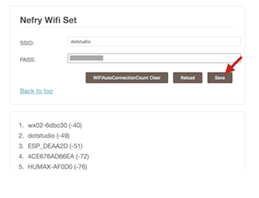

再度，Nefry BTのWi-Fiにつなぎ，トップ画面を開くと，
利用するWi-FiのSSIDとNefry BTのIPアドレスが表示される．

---
## ⑶ Nefry BT の設定ページでSecret Key を登録

トップ画面から「Data Store」に移動．

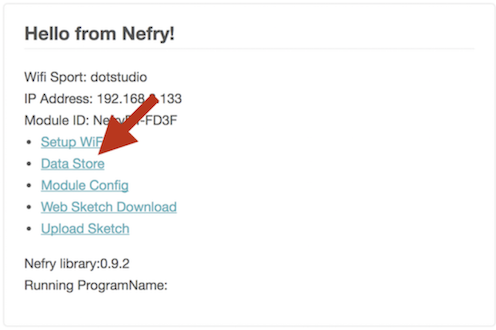

---
## ⑶ Nefry BT の設定ページでSecret Key を登録

先ほど取得したWebhooksの「Secret Key」と「Event Name」を
それぞれ入力し，保存．


---
## ⑶ Nefry BT の設定ページでSecret Key を登録
Nefry BTのボタンを押して試してみましょう！


Nefryのボタンを押すとTweetすることができました！
（IFTTTのサーバ状況により送信に時間がかかる場合があります．）

---

2.LEDを光らせるプログラムを書いてみよう
===
https://dotstud.io/docs/nefrybt-led/

---
## 2.LEDを光らせるプログラムを書いてみよう
###  (0)準備
- Arduino インストール　https://dotstud.io/docs/arduinoide-setup/

- Arduino セットアップ  https://dotstud.io/docs/nefrybt-arduino-ide-setup/

---
## 2.LEDを光らせるプログラムを書いてみよう
###  (0)準備  Arduino インストール
Arduinoのサイトから自身の環境に合わせたダウンロードリンクを選択．次のページでドネーション（寄付金）を求められますが，特に気にせず「JUST DOWNLOAD」を選択し，インストール．

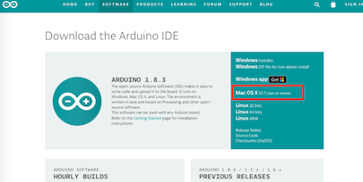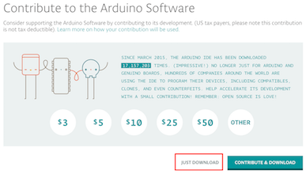

---
## 2.LEDを光らせるプログラムを書いてみよう
###  (0)準備  Arduino インストール
Arduinoファイルを起動し，下記のような画面が表示されれば起動完了．


---
## 2.LEDを光らせるプログラムを書いてみよう
###  (0)準備  Arduino セットアップ
メニューのArduino > Preferencesを選択．追加のボードマネージャのURLのフォームに以下のURLを追加し，OKを選択．

```http://nefry.studio/package_nefrybt_index.json```

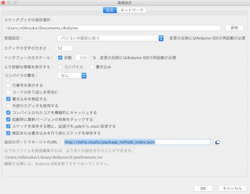

---
## 2.LEDを光らせるプログラムを書いてみよう
###  (0)準備  Arduino セットアップ
メニューのツール > ボード > ボードマネージャを選択．

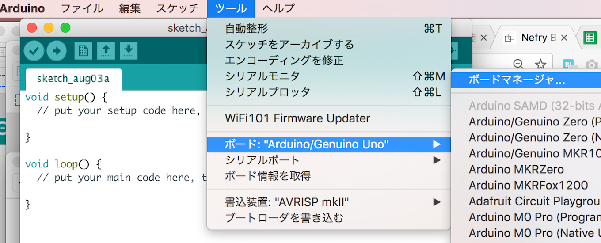

---
## 2.LEDを光らせるプログラムを書いてみよう
###  (0)準備  Arduino セットアップ
フォームにNefryと入力して検索する．


バージョン1.4.0 を選択し，インストールを押す
(バージョンは1.2.2以上のものを選択)

---
## 2.LEDを光らせるプログラムを書いてみよう
### (1)ボードの選択
メニューのツール > ボード > Nefry BT R2/R3を選択．


---
## 2.LEDを光らせるプログラムを書いてみよう
### (2)Nefry BTをPCのUSBポートに挿入

- Nefry BTをPCのUSBポートに挿入．
- メニューのツール > シリアルポート > /dev/cu.usbserial-xxxxxx を選択．(環境によっては /dev/tty.usbserial-xxxxxxなどの場合あり)

※Windowsだと表記が異なる可能性あり

---
## 2.LEDを光らせるプログラムを書いてみよう
### (3)プログラムの書き込み

Arduinoを選択し，メニューのファイル > 新規ファイルを選択．


---
初期状態で書かれているコードを削除し,以下のコードに差し替える
```
#include <Nefry.h>
//フルカラーLED　ランダムにカラーが変わります．
#define SEED_PIN A0

void setup() {
  randomSeed(analogRead(SEED_PIN));
}

int red,green,blue;
void loop() {
  red=random(255);//random関数は0-255の数値をランダムに返します．
  green=random(255);
  blue=random(255);
  Nefry.setLed(red,green,blue);//LEDがランダムに点灯します．
  String color="Red:";color+=red;
  color+=" Green:";color+=green;
  color+=" Blue:";color+=blue;
  Nefry.ndelay(1000);//1秒待つ
}
```
※A0を指定していますが，乱数のSeed用に使っているだけで，
内蔵のLEDがA0という訳ではないです．

---
## 2.LEDを光らせるプログラムを書いてみよう
### (4)プログラムの保存とボードに書き込み

左上の → ボタンを押し，ボード（Nefry BT）にプログラムを書き込む．


---
## 2.LEDを光らせるプログラムを書いてみよう
### (5)確認

無事にプログラム書き込みが終わると，Nefry BTに内蔵してあるLEDがカラフルに光ります．

※プログラムが書き込めない場合は，設定を以下のように変えてみましょう

  ツール >　Upload Speed : 460800

---
3.光センサの情報を取得してfirebaseに記録してみよう
===
---
### firebaseとは
Baas（Backend as a Service）の１つ． 
Webアプリケーションやモバイルアプリケーションのバックエンドで行う機能を提供するクラウドサービス．実装者がバックエンド側の実装をすることなく，決められたAPIを叩くだけでクラウド上に用意された機能群を使うことが出来る．

### 使用するセンサ：光センサ


---
## 3.光センサの情報を取得してfirebaseに記録してみよう
###  (1) 光センサの値を確認する

Nefry BTのA2 と書かれたソケットに光センサを接続する．

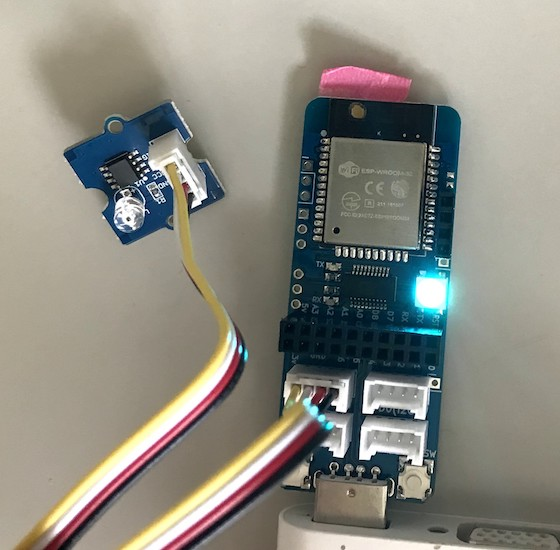

---
<span style="font-size:90%">Arduinoを起動し，メニューのファイル > 新規ファイルを選択．
 新規ファイルに以下のプログラムを書き込み，左上の→ボタンを押し，実行．</span>

```
#include <Nefry.h>
#define PIN A2

void setup()
{
  pinMode(PIN,INPUT);
}

void loop()
{
  long sum = 0;
  // 32回分の合計をする
  for(int i=0; i<32; i++)
  {
    sum += analogRead(PIN);
  }
  // 合計を割って平均を取る
  sum >>= 5;
  Nefry.println(sum);
  Nefry.ndelay(10);
}
```

---
## 3.光センサの情報を取得してfirebaseに記録してみよう
###  (1) 光センサの値を確認する
- ツール > シリアルモニタ(command+shift+M) を選択し，
115200bpsに設定すると値を確認できる．
- ツール > シリアルプロット(command+shift+L) を選択し，
115200bpsに設定するとグラフで可視化される

※注意：同時に2つ開くことはできない

※音センサも同じプログラムで実行可能

---
###  (2) Firebaseへの記録

1. Firebase を開く　https://firebase.google.com/?hl=ja
2. スタートガイドをクリック

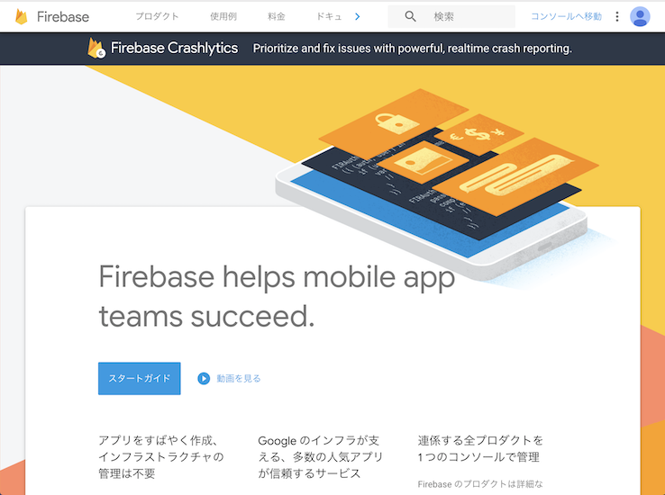

---
###  (2) Firebaseへの記録
3.
    - プロジェクト名　nefry
    - アナリティクスと課金の地域　日本
   と設定し，プロジェクトを作成


---
###  (2) Firebaseへの記録
4.「Database」を選択し，「Realtime Database」を選択

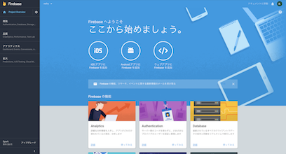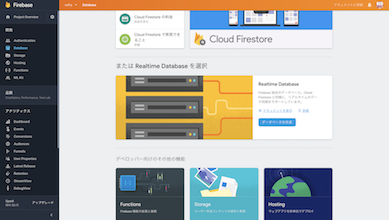

---
###  (2) Firebaseへの記録

5.「テストモードで開始」を選択し，「有効にする」をクリック


---
###  (2) Firebaseへの記録
6.databaseのURLをコピーしておく


---
###  (2) Firebaseへの記録
7. Nefryに以下のコードを書き込む  
FIREBASE_HOSTは先程コピーしたものを記述(https:// は除く)
<!--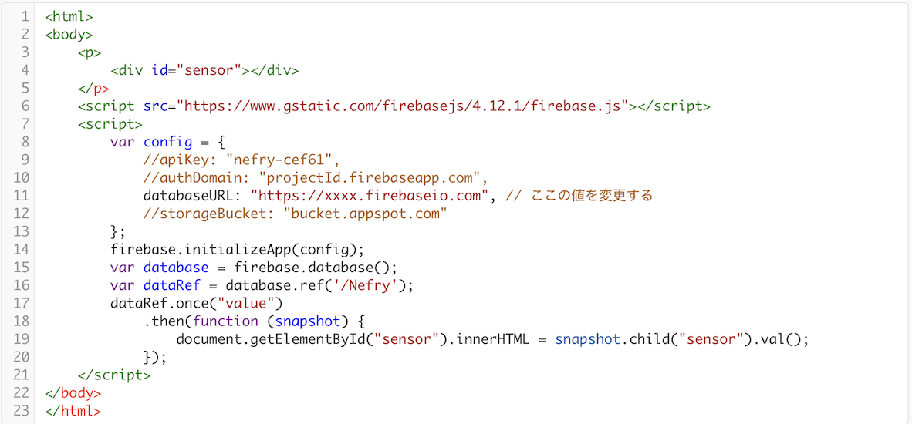-->
```
#include <Nefry.h>
#include <NefryFireBase.h>
#define PIN A2
#define FIREBASE_HOST "xxxx.firebaseio.com"

NefryFireBase firebase;

void setup()
{
  pinMode(PIN,INPUT);
  firebase.begin(FIREBASE_HOST);
}

void loop()
{
  DataElement elem = DataElement();
  elem.setValue("sensor", analogRead(PIN));
  firebase.write("Nefry", &elem);//FireBaseのデータを書き込む
  Nefry.ndelay(1000);
}
```

---
###  (2) Firebaseへの記録
8. 光センサの値がFireBaseでリアルタイムに更新されるのが確認できる


---
## (3) webページを作成し,ブラウザで光センサの値を表示
---
以下のソースコードのdatabaseURLを変更し，htmlページを作成．
```
<html>
<body>
    <p>
        <div id="sensor"></div>
    </p>
    <script src="https://www.gstatic.com/firebasejs/4.12.1/firebase.js"></script>
    <script>
        var config = {
            //apiKey: "nefry-cef61",
            //authDomain: "projectId.firebaseapp.com",
            databaseURL: "https://xxxx.firebaseio.com", // ここの値を変更する
            //storageBucket: "bucket.appspot.com"
        };
        firebase.initializeApp(config);
        var database = firebase.database();
        var dataRef = database.ref('/Nefry');
        dataRef.once("value")
            .then(function (snapshot) {
                document.getElementById("sensor").innerHTML = snapshot.child("sensor").val();
            });
    </script>
</body>
</html>
```
---
### (3)webページを作成し，ブラウザで光センサの値を表示
Command+R or 左上の更新ボタン で更新すると，
光センサの値が確認できる．


---

# 付録(他のセンサの使い方)
光センサ以外のセンサーや出力装置のサンプルコードを紹介

サンプルによってはArduino IDEに外部ライブラリのインストールが必要

参考ページ http://wiki.seeedstudio.com/Sensor/

---
###  センサ一覧     　　 http://wiki.seeedstudio.com/
サーボモータ


光センサ/音センサ/傾きセンサ/水センサ

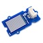

モーションセンサ/温度湿度センサ/LEDbarセンサ

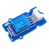

その他→ https://dotstud.io/docs/grove/

---
#### 音センサ
  http://wiki.seeedstudio.com/Grove-Sound_Sensor/

A0に接続し，下記プログラムを実行．

ツール > シリアルモニタ or シリアルプロットで値を確認できる
```
const int pinAdc = A0;
void setup()
{
 Serial.begin(115200);
}
void loop()
{
 long sum = 0;
 for(int i=0; i<32; i++)
 {
 sum += analogRead(pinAdc);  //32回計測
 }
sum >>= 5; // 平均を算出 
Serial.println(sum);
delay(10); //10ms周期で計測
}
```

---
#### 傾向センサ/水センサ(/音センサ)
  
```
#define PIN D2

void setup()
{
 Serial.begin(115200);
 pinMode(PIN,INPUT);
}

void loop()
{
  int v = digitalRead(PIN);
  Serial.println(v);
  delay(10);
}
```
ツール > シリアルモニタ or シリアルプロットで値を確認できる

---
#### モーションセンサ (動きのある人を検知)

```
#define PIN D2

void setup()
{
 Serial.begin(115200);
 pinMode(PIN,INPUT);
}

void loop()
{
 if(digitalRead(PIN))//if it detects the moving people?
    Serial.println("Hi,people is coming");
 else
    Serial.println("Watching");

 delay(200);
}
```

---

#### サーボモータ
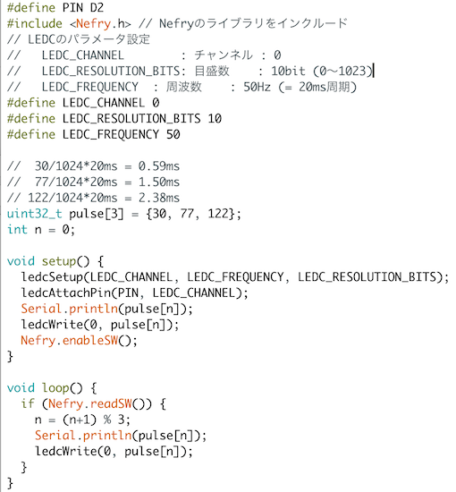

---
```
#include <Nefry.h> // Nefryのライブラリをインクルード
#define PIN D2
// LEDCのパラメータ設定
#define LEDC_CHANNEL 0           //  チャンネル : 0
#define LEDC_RESOLUTION_BITS 10 // 目盛数 : 10bit (0〜1023)
#define LEDC_FREQUENCY 50      //周波数 : 50Hz (= 20ms周期)

//  30/1024*20ms = 0.59ms
//  77/1024*20ms = 1.50ms
// 122/1024*20ms = 2.38ms
uint32_t pulse[3] = {30, 77, 122};
int n = 0;

void setup() {
  ledcSetup(LEDC_CHANNEL, LEDC_FREQUENCY, LEDC_RESOLUTION_BITS);
  ledcAttachPin(PIN, LEDC_CHANNEL);
  Serial.println(pulse[n]);
  ledcWrite(0, pulse[n]);
  Nefry.enableSW();
}

void loop() {
  if (Nefry.readSW()) {
    n = (n+1) % 3;
    Serial.println(pulse[n]);
    ledcWrite(0, pulse[n]);
  }
}
```

---
#### 温度湿度センサ
以下のライブラリをインストールする

https://github.com/adafruit/Adafruit_Sensor

https://github.com/adafruit/DHT-sensor-library

---
### 外部ライブラリのインポートの方法  
1.zip形式でダウンロード


---
2.Arduino IDEを起動し，スケッチ > ライブラリをインクルード > ZIP形式のライブラリをインストール


---
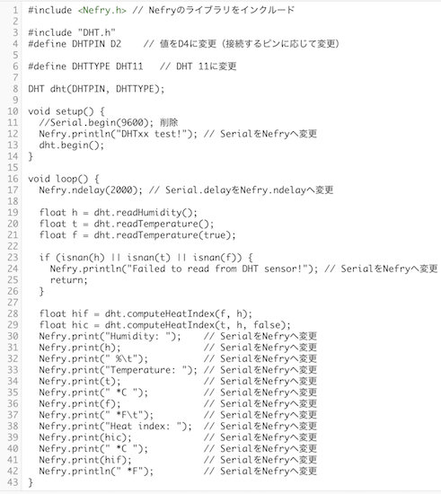

---
```
#include <Nefry.h> // Nefryのライブラリをインクルード

#include "DHT.h"
#define DHTPIN D2    // 値をD4に変更（接続するピンに応じて変更）

#define DHTTYPE DHT11   // DHT 11に変更

DHT dht(DHTPIN, DHTTYPE);

void setup() {
  //Serial.begin(9600); 削除
  Nefry.println("DHTxx test!"); // SerialをNefryへ変更
  dht.begin();
}

void loop() {
  Nefry.ndelay(2000); // Serial.delayをNefry.ndelayへ変更

  float h = dht.readHumidity();
  float t = dht.readTemperature();
  float f = dht.readTemperature(true);

  if (isnan(h) || isnan(t) || isnan(f)) {
    Nefry.println("Failed to read from DHT sensor!"); // SerialをNefryへ変更
    return;
  }

  float hif = dht.computeHeatIndex(f, h);
  float hic = dht.computeHeatIndex(t, h, false);
  Nefry.print("Humidity: ");    // SerialをNefryへ変更
  Nefry.print(h);               // SerialをNefryへ変更
  Nefry.print(" %\t");          // SerialをNefryへ変更
  Nefry.print("Temperature: "); // SerialをNefryへ変更
  Nefry.print(t);               // SerialをNefryへ変更
  Nefry.print(" *C ");          // SerialをNefryへ変更
  Nefry.print(f);               // SerialをNefryへ変更
  Nefry.print(" *F\t");         // SerialをNefryへ変更
  Nefry.print("Heat index: ");  // SerialをNefryへ変更
  Nefry.print(hic);             // SerialをNefryへ変更
  Nefry.print(" *C ");          // SerialをNefryへ変更
  Nefry.print(hif);             // SerialをNefryへ変更
  Nefry.println(" *F");         // SerialをNefryへ変更
}
```

---
#### LEDbarセンサ

1. ライブラリ https://github.com/Seeed-Studio/Grove_LED_Bar をダウンロード
2. Arduino IDEを起動し，スケッチ > ライブラリをインクルード > ZIP形式のライブラリをインストール
3. スケッチ例 > Grove LED Bar >Levelをクリック

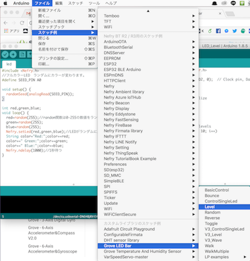

---
#### LEDbarセンサ
4. 下記プログラムを実行
```
#include <Grove_LED_Bar.h>
//Clock pin,Data pin, Orientation
Grove_LED_Bar bar(D3, D2, 0);

void setup()
{
  // nothing to initialize
  bar.begin();
}

void loop()
{
  // Walk through the levels
  for (int i = 0; i <= 10; i++)
  {
    bar.setLevel(i);
    delay(100);
  }
}
```